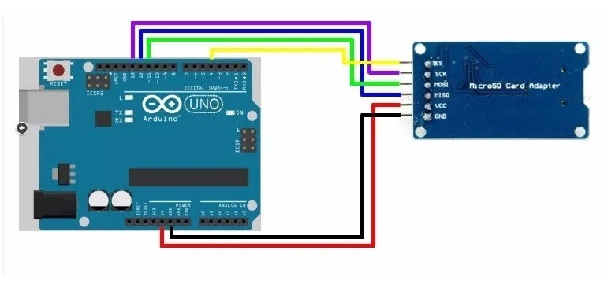

# SD Card Info Arduino

SD card test in Arduino board.

Adapted of Limor Fried and Tom Igoe

This example shows how use the utility libraries on which the SD library is
based in order to get info about your SD card.
Very useful for testing a card when you're not sure whether its working or
not.

#### Circuit:

